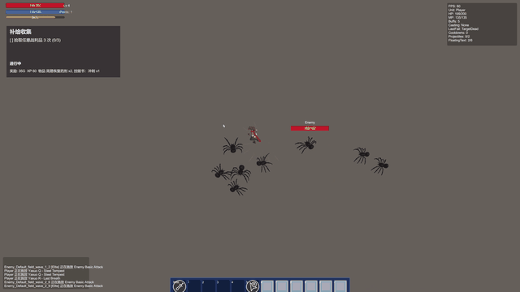

# Combat System

一个基于 Unity 2022.3 LTS 的个人 ARPG 练手项目。项目从战斗系统原型出发，逐步扩展到具备场景流转、成长、掉落、任务、商店与存档能力的可游玩 vertical slice，重点放在数据驱动设计、系统拆分、编辑器工具链和基础自动化验证上。

## 项目定位

- 类型：俯视角 Action RPG / Diablo-like vertical slice
- 目标：验证“战斗系统 -> 可游玩主循环 -> 内容扩展”的工程路线
- 当前主循环：Main Menu -> Town -> Field -> Boss -> 回城/继续 -> Save & Load
- 项目重心：运行时系统设计、场景与流程打通、编辑器辅助工具、基础测试覆盖
- 说明：部分美术与演示资源使用第三方免费素材，核心玩法代码、运行时系统和编辑器工具为个人实现

## Demo

[](docs/media/unity-combat-demo.mp4)

- README 预览：`docs/media/unity-combat-demo.gif`
- 完整演示视频（2m10s）：[`docs/media/unity-combat-demo.mp4`](docs/media/unity-combat-demo.mp4)
- 演示内容包含基础战斗、HUD/UI、场景流程与实际游玩片段

## 核心内容

- 数据驱动配置：技能、Buff、单位、关卡、任务、遭遇、成长、物品、掉落、商店等均基于 `ScriptableObject` 定义，并由 `GameDatabase` 统一索引
- 战斗系统：技能施放、目标选择、效果执行、资源消耗、冷却、Buff/Modifier、投射物与事件总线
- RPG 系统：等级与经验、属性点、背包、装备、随机掉落、商店交易、任务追踪、Boss 与遭遇配置
- 场景与存档：`Town` / `Field` / `Boss` 多场景流转，出生点/传送门，存档位、继续游戏、场景恢复
- UI 与输入：`UIRoot + Screen / Modal / HUD / Overlay` 分层 UI 架构，Unity Input System 统一输入抽象，支持键鼠与手柄
- 工具链与验证：一键生成可玩流程、输入资产生成、内容搭建工具、PlayMode 回归测试和性能烟测

## 技术栈

- Unity `2022.3.62f3` LTS
- Universal Render Pipeline (URP)
- C#
- Unity Input System
- UGUI + TextMeshPro
- Unity Test Framework

## 架构概览

- `Assets/_Game/Scripts/Data`：`ScriptableObject` 定义与 `GameDatabase`
- `Assets/_Game/Scripts/Core`：单位根对象、属性/生命/资源、事件总线、成长核心
- `Assets/_Game/Scripts/Gameplay`：技能、目标、效果、关卡流转、任务、掉落、背包、装备、Boss/遭遇
- `Assets/_Game/Scripts/UI`：Screen / Modal / HUD / Overlay UI 框架与具体界面
- `Assets/_Game/Scripts/Persistence`：存档、读档、设置数据
- `Assets/_Game/Scripts/Input`：输入抽象层
- `Assets/_Game/Scripts/Editor`：场景生成、UI 搭建、输入资产生成、内容配置辅助工具

```text
Assets/
  _Game/
    Scripts/
    Input/
    ScriptableObjects/
  Scenes/
  Tests/
docs/
Project_Context.md
LICENSES_THIRDPARTY.md
```

## 本地运行

1. 使用 Unity Hub 打开项目，Unity 版本为 `2022.3.62f3`
2. 首次打开后运行菜单 `Combat/Generate Playable Flow`
3. 打开场景 `Assets/Scenes/MainMenu.unity`
4. 进入 Play Mode，选择 `New Game` 或 `Continue`

## 默认操作

- 移动：`WASD` / 方向键 / 手柄左摇杆
- 瞄准：鼠标位置
- 技能：`1` - `6`
- 背包：`I`
- 暂停 / 返回：`Esc`
- 调试覆盖层：`F3`

## 测试与验证

- 在 Unity 中打开 `Window > General > Test Runner` 可运行 `EditMode` 与 `PlayMode` 测试
- PlayMode 覆盖战斗伤害回归、掉落与商店、任务系统、遭遇/Boss、性能烟测
- EditMode 包含技能表现计划校验
- 性能烟测会为 `Field` 和 `Boss` 场景输出基线日志到 `Logs/`

## 这个项目主要练习的内容

- 用 `ScriptableObject + GameDatabase` 组织可扩展的玩法配置
- 用事件总线降低战斗系统、UI 和成长系统之间的直接耦合
- 用编辑器工具降低场景、输入和内容搭建的重复劳动
- 用 PlayMode 测试为系统迭代提供基础回归保护

## 仓库说明

- 这是一个以系统设计和工程实践为主的个人项目，不以商业完成度为目标
- 美术与演示资源主要用于原型验证，第三方资源说明见 `LICENSES_THIRDPARTY.md`
- 设计背景与扩展规划可参考 `Project_Context.md` 以及 `docs/`
