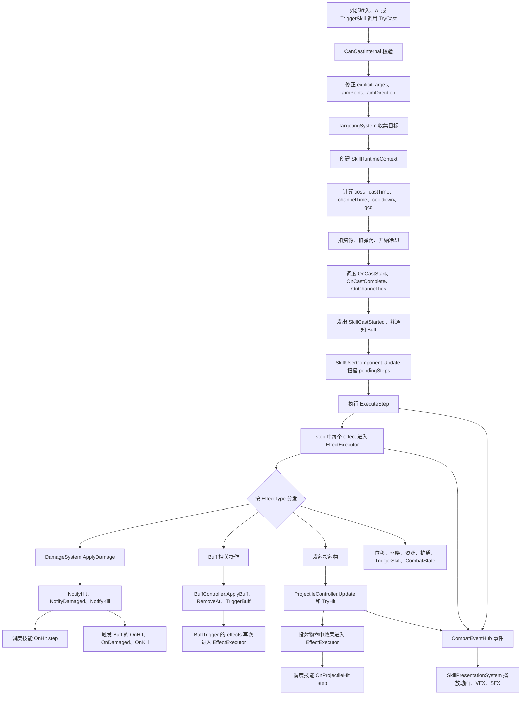
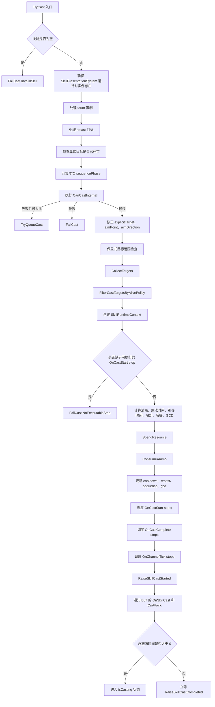
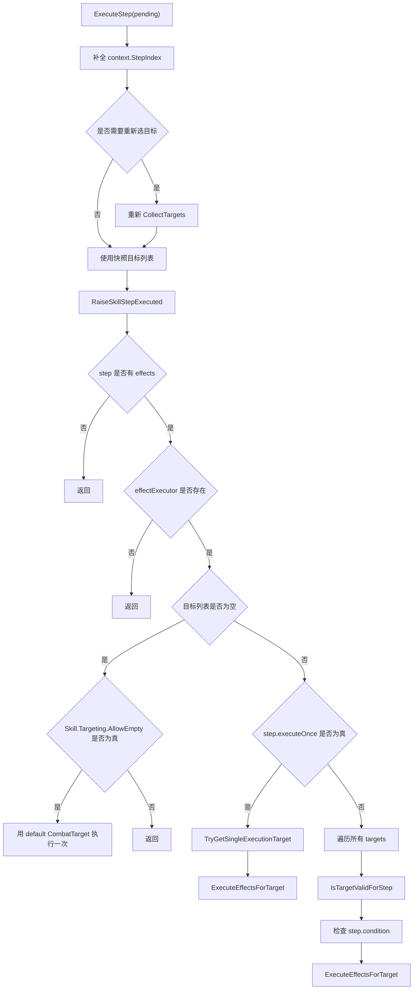
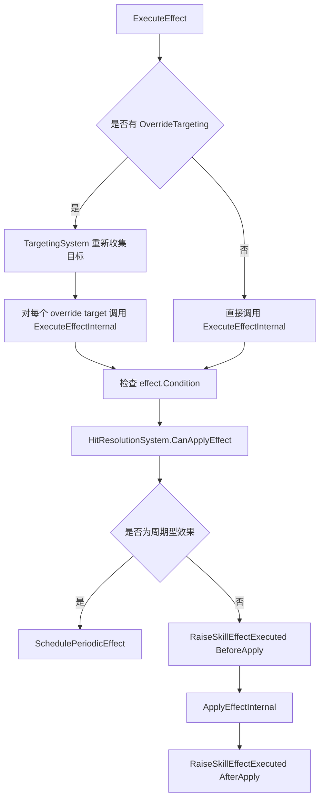
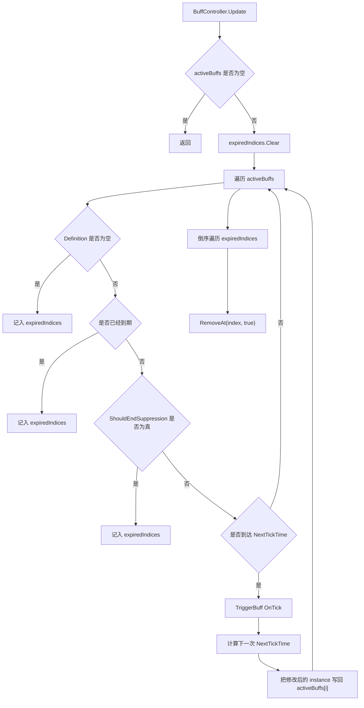
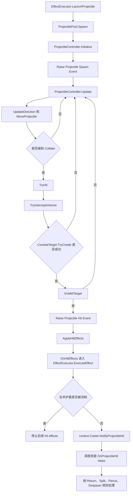

# 技能 / Buff / 效果执行链路详解

这份文档不是“概念介绍”，而是按代码实际运行顺序，把这个项目里技能、Buff、效果执行、投射物、命中裁决、表现层是怎么串起来的拆开讲。

如果你一路从 `BuffController` 或 `EffectExecutor` 往里硬看，确实会很累，因为这个系统不是 UE GAS 那种“一个技能一个脚本入口”。它更像一个数据驱动的流水线：

1. `SkillDefinition` 负责声明“这个技能有哪些 step，在什么时机触发”。
2. `SkillUserComponent` 负责校验施法、收集目标、创建运行时上下文、调度 step。
3. `EffectExecutor` 负责真正执行每个 `EffectDefinition`。
4. `BuffController` 负责管理 Buff 实例，并在指定时机把 Buff trigger 重新送回 `EffectExecutor`。
5. `DamageSystem` / `ProjectileController` / `HitResolutionSystem` / `TargetingSystem` 负责中间各个专门分支。
6. `CombatEventHub` + `SkillPresentationSystem` 负责把“逻辑事件”转成动画、特效、音效。

所以你会觉得“一个技能定义完了，但逻辑到底写在哪”。答案是：

- “什么时候做”写在 `SkillStep.trigger` + `SkillStep.delay`
- “做什么”写在 `SkillStep.effects`
- “对谁做”写在 `TargetingDefinition` 或 `EffectDefinition.OverrideTargeting`
- “能不能做”写在 `ConditionDefinition`
- “怎么做”写在 `EffectExecutor`、`DamageSystem`、`ProjectileController`、`BuffController`
- “播什么动画和特效”写在 `SkillStep.presentationCues`，由 `SkillPresentationSystem` 监听事件后执行

---

## 1. 先看总图

这一张图最重要的一点是：系统不是直线，而是多次“重新进入”主流水线。

最常见的重新进入有 4 种：

1. `OnHit`：伤害结算后，技能自己的 `OnHit` step 会被重新调度。
2. `OnProjectileHit`：投射物命中后，技能自己的 `OnProjectileHit` step 会被重新调度。
3. `BuffTrigger`：Buff 在 `OnApply` / `OnTick` / `OnHit` / `OnDamaged` / `OnExpire` 等时机触发后，会再次调用 `EffectExecutor`。
4. `TriggerSkill`：一个效果还能直接触发另一个技能，重新走 `TryCast`。

---

## 2. 组件职责地图

| 组件 | 主要职责 | 关键方法 | 你读代码时要带着的问题 |
| --- | --- | --- | --- |
| `SkillDefinition` | 技能静态定义 | 数据字段 | 这个技能有哪些 step，施法参数是什么 |
| `SkillUserComponent` | 技能入口、施法校验、step 调度、技能运行时状态 | `TryCast`、`CanCastInternal`、`ScheduleSteps`、`ExecuteStep` | 技能什么时候开始，什么时候真正执行 step |
| `SkillRuntimeContext` | 本次施法的运行时快照 | 构造函数、`WithStepIndex` | 本次施法的 caster、aim、explicitTarget、charge、castId 是什么 |
| `TargetingSystem` | 收集目标、验证目标形状和 LoS | `CollectTargets`、`IsWithinTargetingShape`、`HasLineOfSight` | 目标是谁，范围判定怎么做 |
| `EffectExecutor` | 执行 `EffectDefinition` | `ExecuteEffect`、`ExecuteEffectInternal`、`ApplyEffectInternal` | 一个 effect 到底做了什么 |
| `HitResolutionSystem` | 命中拦截、法术护盾、无敌、不可选取、隐身可见性 | `CanSelectTarget`、`CanApplyEffect` | 为什么这次效果没生效 |
| `DamageSystem` | 伤害数值计算与命中后回调 | `ApplyDamage` | 伤害怎么算，on-hit 什么时候发 |
| `BuffController` | Buff 实例管理、堆叠、Tick、触发器、打断施法 | `ApplyBuff`、`Update`、`TriggerBuffs`、`TriggerBuff` | Buff 什么时候生效，什么时候再触发效果 |
| `ProjectileController` | 投射物生命周期 | `Initialize`、`Update`、`TryHit`、`ApplyHitEffects` | 投射物什么时候命中，命中后做什么 |
| `CombatEventHub` | 逻辑事件总线 | `RaiseSkillStepExecuted` 等 | 哪些逻辑节点会广播事件 |
| `SkillPresentationSystem` | 用事件驱动表现层 | `HandleSkillStepExecuted`、`HandleSkillEffectExecuted`、`HandleProjectileLifecycle` | 动画和特效在哪里决定 |

---

## 3. 数据层到底定义了什么

### 3.1 `SkillDefinition` 不是技能逻辑脚本

`SkillDefinition` 里最关键的不是“写代码”，而是这些数据：

- 施法节奏：`CastTime`、`ChannelTime`、`PostCastTime`、`GcdDuration`、`QueueWindow`
- 资源与冷却：`ResourceCost`、`Cooldown`
- 高级机制：`AmmoConfig`、`RecastConfig`、`SequenceConfig`
- 目标逻辑：`Targeting`
- 施法前约束：`CastConstraints`
- 执行主体：`Steps`

你可以把它理解为：

- `SkillDefinition` 定义“这次施法应该产生哪些阶段”
- `SkillStep` 定义“某个阶段到了以后，要按什么顺序执行哪些 effect”

### 3.2 `SkillStep` 决定“时机”

每个 `SkillStep` 有几项核心字段：

- `trigger`
- `delay`
- `condition`
- `executeOnce`
- `presentationCues`
- `effects`

这里一定要分清：

- `SkillStep` 管的是“什么时候执行”
- `EffectDefinition` 管的是“执行什么”

### 3.3 `EffectDefinition` 决定“内容”

`EffectDefinition` 是系统里的最小执行单元。

它描述的是“对一个目标做一件事”，比如：

- 造成伤害
- 治疗
- 上 Buff
- 移除 Buff
- 发射投射物
- 位移
- 改资源
- 加护盾
- 召唤
- 触发另一个技能
- 清除控制 / 修改战斗状态

关键字段：

- `EffectType`
- `Condition`
- `OverrideTargeting`
- `Value`
- `DamageType`
- 缩放 / 暴击相关字段
- `TriggersOnHit`
- `Buff`
- `Projectile`
- `TriggeredSkill`
- `Duration` + `Interval`
- 位移参数
- 召唤参数
- CombatState 参数

`EffectDefinition.OverrideTargeting` 可以覆盖 step 传下来的目标。所以即便 step 只执行一次，只要 effect 自己重新选目标，它仍然可以从一个 step 扩散到多个实际命中目标。

### 3.4 `BuffDefinition` 决定“挂到身上以后怎么继续活”

Buff 本身不是单纯的 tag 或 stat modifier，它还可以带触发器。

核心字段：

- `Duration`
- `TickInterval`
- `StackingRule`
- `MaxStacks`
- `Tags`
- `Modifiers`
- `Triggers`
- `ControlEffects`
- `ControlImmunities`

`BuffTrigger` 里最关键的是：

- `triggerType`
- `chance`
- `condition`
- `effects`

所以 Buff 不只是“挂着改变属性”，它还是一个持续驻留在单位身上的事件脚本容器。只是这个脚本不是 C# 类，而是数据定义 + `BuffController` 运行时解释执行。

### 3.5 `ConditionDefinition` 决定“能不能过”

它是一个通用条件树，能被多个地方复用：

- 施法前约束
- step 条件
- effect 条件
- buff trigger 条件

支持判断：

- 概率
- tag
- buff 持有
- buff 层数
- 控制状态
- 生命比例
- 存活 / 死亡
- 连段阶段 `SequencePhase`

### 3.6 `SkillRuntimeContext` 是整条链的“胶水”

每次施法都会构造一个 `SkillRuntimeContext`，它把运行时信息包起来往下传：

- `Caster` / `CasterUnit`
- `Skill`
- `EventHub`
- `Targeting`
- `Executor`
- `HasAimPoint` / `AimPoint` / `AimDirection`
- `ExplicitTarget`
- `ChargeDuration` / `ChargeRatio` / `ChargeMultiplier`
- `CastId`
- `StepIndex`
- `SequencePhase`
- 施法者缓存组件：`CasterStats` / `CasterHealth` / `CasterBuffs`

### 3.7 `CombatTarget` 是“目标快照”

`CombatTarget` 缓存的是目标常用组件引用：

- `GameObject`
- `Transform`
- `Unit`
- `Stats`
- `Health`
- `Resource`
- `Tags`
- `Team`
- `State`
- `Visibility`
- `Buffs`

---

## 4. 技能施法入口：`SkillUserComponent.TryCast`

这是整个系统最重要的起点。

### 4.1 施法主流程图

### 4.2 `TryCast` 先做的不是执行 step，而是“把这次请求校准”

它前面做了大量预处理：

1. `skill == null` 直接失败。
2. `SkillPresentationSystem.EnsureRuntimeInstance()`。
   - 这是为了确保后面任何逻辑事件发出去时，表现层监听器已经在场。
3. 处理 taunt。
   - 如果身上有 taunt，且要放的不是允许的普攻，那么直接失败。
   - 如果 taunt 有来源，还会把 `explicitTarget` 强行改成 taunter。
4. 处理 recast。
   - 如果当前技能在重施窗口中，这次施法会先按 `RecastTargetPolicy` 解析目标。
5. 显式目标死亡检查。
6. 算 `sequencePhase`。
   - 本次释放到底是 Q1 / Q2 / Q3 的哪一段，不是在 step 执行时再猜，而是在施法入口先定下来。

### 4.3 `CanCastInternal` 做的是“施法资格审查”

它检查的东西很多：

- 技能是否为空
- taunt 是否限制施法
- 当前是否 lockout
  - `isCasting`
  - `recoveryEndTime`
  - `gcdEndTime`
- 身上控制是否阻止施法
  - `BlocksCasting`
  - `BlocksBasicAttack`
- 自己是不是已经死了
- recast 目标是否有效
- 冷却是否结束
- 显式目标是否死亡
- 弹药是否足够
- `CastConstraints` 是否满足
- 资源是否足够

也就是说，真正进入 step 调度之前，技能系统已经把“这次施法从设计规则上是否合法”检查完了。

### 4.4 失败时不一定是真失败，可能进入输入缓冲

如果 `CanCastInternal` 失败，但失败原因是当前处于施法 / 后摇 / GCD 锁定中，那么 `TryCast` 会尝试：

- `TryQueueCast(...)`

这表示：

- 不是所有失败都会立刻丢掉输入
- 如果当前时间处于 `QueueWindow`，系统允许把这次输入缓存到 `queuedCast`
- 等锁定结束以后，`Update()` 里的 `TryConsumeQueuedCast()` 会重新执行这次请求

### 4.5 `explicitTarget`、`aimPoint`、`aimDirection` 会被重新修正

`TryCast` 在通过基础校验后，还会重新整理：

- `effectiveExplicitTarget`
- `aimPoint`
- `aimDirection`

处理逻辑包括：

1. 如果是 `TargetPoint` 技能且没有 `aimPoint`，但有目标，那么把目标位置当成 `aimPoint`
2. 如果是要求显式目标的锁定技能，那么朝向会强行改成“指向目标”的方向
3. 如果当前没有 `aimDirection`，但有显式目标，就根据施法者到目标的方向补一个
4. 如果有 `aimPoint` 但没 `aimDirection`，就根据施法者到 `aimPoint` 的方向补一个

### 4.6 目标收集不是在 step 执行时才第一次做

`TryCast` 会先调用：

- `CollectTargets(...)`
- `FilterCastTargetsByAlivePolicy(...)`

注意几点：

1. 如果 `targetingSystem == null` 或 `skill.Targeting == null`，默认尝试把自己作为目标。
2. 如果 `RequireExplicitTarget == true` 且没传目标，直接失败。
3. `CollectTargets` 收集不到目标，不一定失败。
   - 如果 `AllowEmpty == true`，依然可以通过。
4. `FilterCastTargetsByAlivePolicy` 会根据 `HitValidationPolicy` 把死亡目标剔掉。

这一步的产物是一份“本次施法初始时刻的目标列表”。

### 4.7 `SkillRuntimeContext` 在施法入口就创建

`TryCast` 会调用 `CreateContext(...)` 构造上下文。

这里放进去的是本次施法的关键语义：

- 本次技能是谁施放的
- 用的哪个技能
- 当时有没有 aimPoint
- aimPoint 是哪里
- aimDirection 是什么
- explicitTarget 是谁
- 蓄力时间 / 比例 / 倍率
- castId
- 当前连段阶段

### 4.8 `HasExecutableConditionalCastStartStep` 是一个前置保护

如果技能要求显式目标，并且它的 `OnCastStart` step 里有条件，那系统会先检查：

- 当前目标列表里，是否至少存在一个目标，能让某个 `OnCastStart` step 真的执行

如果答案是否，就直接 `FailCast(NoExecutableStep)`。

这避免出现“形式上选到了目标，但 step 条件全不成立，技能却仍然白白进入施法”的情况。

### 4.9 资源、时间、冷却都是按 modifier 后的值结算

`TryCast` 会先取：

- `resourceCost`
- `cooldownDuration`
- `castTime`
- `channelTime`
- `postCastTime`
- `gcdDuration`
- `channelTickInterval`
- `queueWindow`

这些值都经过 `ModifierResolver.ApplySkillModifiers(...)` 处理。

另外还有两条特殊规则：

- 普攻类技能的冷却走攻速缩放 `ApplyAttackSpeed`
- 非普攻技能冷却走技能急速 `ApplyAbilityHaste`

### 4.10 施法成功后会立刻更新多个运行时系统

施法成功后，`TryCast` 做的事情不是“立刻放效果”，而是：

1. `SpendResource`
2. `ConsumeAmmo`
3. 视情况 `cooldown.StartCooldown(...)`
4. `UpdateRecastAfterSuccessfulCast(...)`
5. `UpdateSequenceAfterSuccessfulCast(...)`
6. `ResetSequencesMarkedOnOtherCast(...)`
7. 设置 GCD

真正的效果执行是下一步的 step 调度。

### 4.11 施法成功后调度 step，而不是直接执行

`TryCast` 会创建一个目标列表句柄 `TargetListHandle`，然后调度：

- `ScheduleSteps(skill, OnCastStart, now, targetHandle, context)`
- `ScheduleSteps(skill, OnCastComplete, now + totalTime, targetHandle, context)`
- `ScheduleChannelTicks(...)`

也就是说：

- step 不是立刻在 `TryCast` 里跑
- 它们先被转成 `PendingStep`
- 等 `SkillUserComponent.Update()` 里按时间戳执行

---

## 5. `pendingSteps` 到底存了什么

`PendingStep` 结构里存的是：

- `Step`
- `Trigger`
- `StepIndex`
- `ExecuteAt`
- `Targets`
- `Context`

你可以把它理解成一句话：

“在某个时间点，用某次施法的上下文，对某份目标列表，执行这个 step。”

### 5.1 目标列表为什么还要包一层 `TargetListHandle`

因为一个技能通常不止一个 step。

所以系统不是给每个 step 复制一份 `List<CombatTarget>`，而是：

1. 创建一份目标列表
2. 用 `TargetListHandle` 包起来
3. 每调度一个 pending step，就 `RefCount++`
4. 每执行完一个 pending step，就 `ReleaseHandle(...)`
5. 引用数归零时再把列表还给池

### 5.2 `SkillUserComponent.Update()` 才是实际推进 step 的地方

`Update()` 每帧会：

1. 更新 ammo recharge
2. 更新 recast expiry
3. 更新 sequence expiry
4. 倒序扫描 `pendingSteps`
5. 对 `ExecuteAt <= now` 的 step 执行：
   - `ExecuteStep(pending)`
   - `ReleaseHandle(pending.Targets)`
   - `pendingSteps.RemoveAt(i)`
6. 如果当前施法已经到 `castEndTime`
   - 触发 `RaiseSkillCastCompleted`
   - `ClearCastState()`
7. 如果当前没有在施法
   - 处理 taunt 自动行为
   - 尝试消费输入缓冲

注意：`RaiseSkillCastCompleted` 和 `OnCastComplete` step 执行不是同一件事。

### 5.3 打断施法，取消的是 future pending step

`InterruptCast()` 干的事情是：

1. 取当前上下文
2. `ClearPendingSteps(currentSkill)`
3. `RaiseSkillCastInterrupted(...)`
4. 把 `recoveryEndTime` 设成当前时间 + `currentPostCastTime`
5. `ClearCastState()`

而 `ClearPendingSteps(currentSkill)` 会删掉当前技能相关且 trigger 属于以下三类的 pending step：

- `OnCastStart`
- `OnCastComplete`
- `OnChannelTick`

这意味着：

- 未来还没执行的前摇结束 step、引导 tick、落地 step 会被取消
- 已经执行过的东西不会回滚
- `OnHit` / `OnProjectileHit` 这种已经被其他链路重新调度的 step 不在这里清掉

---

## 6. Step 真正执行时发生什么：`ExecuteStep`

### 6.1 Step 执行流程图

### 6.2 第一步：补全 `StepIndex`

`pending.Context` 里最初的 `StepIndex` 是 `-1`。

到了 `ExecuteStep`，它会：

- `var context = pending.Context.WithStepIndex(pending.StepIndex);`

这样做的意义是：

- 事件会带正确的 `StepIndex`
- 表现层系统知道“是第几个 step 触发了事件”
- projectile lifecycle 事件也能带着这个 step index 继续往后传

### 6.3 有些技能会在 step 执行时重新选目标

这由 `TargetSnapshotPolicy` 决定：

- `PerStep`
  - 每个 step 执行时都重新 `CollectTargets`
- `AtCastComplete`
  - `OnCastStart` 用开技能时的快照
  - 非 `OnCastStart` 的 step 执行时重选目标
- `AtCastStart`
  - 全程使用施法开始时的目标快照

### 6.4 `RaiseSkillStepExecuted` 发生在 effect 之前

`ExecuteStep` 在真正跑 effect 之前，就会派发：

- `RaiseSkillStepExecuted(context, step, trigger, primaryTarget, stepIndex)`

这对表现层很重要，因为有些动画 / 前摇 VFX 需要在真正应用效果之前就播。

### 6.5 没目标时不一定不执行

如果 `targets.Count == 0`，代码不会直接终止。

它还会检查：

- `context.Skill.Targeting.AllowEmpty`

如果允许空目标，它会：

1. 构造 `default(CombatTarget)` 作为占位目标
2. 检查 `step.condition`
3. 逐个执行 effect

这样设计的意义是：

- 某些 effect 根本不依赖具体单位目标
- 比如朝指定方向发射投射物
- 比如在 `aimPoint` 召唤物体

### 6.6 `executeOnce` 的语义不是“这个 step 只会影响一个最终目标”

`step.executeOnce` 做的只是：

- 从目标列表里挑一个执行目标
- 让这个 step 的 effect 链只以这个 execution target 执行一次

但如果 effect 自己有 `OverrideTargeting`，它仍然可以：

- 以这个 execution target 为起点
- 再收集一批新的目标
- 对那批目标分别执行

### 6.7 `ExecuteEffectsForTarget` 内部还会再次处理条件和法术护盾

它做的事情是：

1. 再次检查 `step.condition`
2. 记录当前目标的法术护盾层数
3. 顺序执行 `effects[j]`
4. 每执行一个 effect 后检查法术护盾是否被消耗
5. 如果护盾被消耗，停止当前目标本次 step 剩余 effect

这条规则非常重要：法术护盾可以中断同一个 step 在同一个目标上的后续效果。

### 6.8 `IsTargetValidForStep` 不是走过场，它会做二次命中校验

即使 `TryCast` 时已经收集过目标，step 真正执行时仍然会调用：

- `IsTargetValidForStep(context, trigger, target)`

它会检查：

1. `target.IsValid`
2. `HitResolutionSystem.CanSelectTarget(...)`
3. `HitValidationPolicy`
   - `None`
   - `AliveOnly`
   - `InRange`
   - `InRangeAndLoS`
4. 如果不是 `OnHit` / `OnProjectileHit`
   - 还可能重新做形状范围校验
   - 还可能重新做 LoS 校验

所以这套系统不是“施法时收集到了目标，后面就一定打中”。

只要目标跑出了形状、死了、失去可见性，或者当前 trigger 需要重新校验，它仍然可能在 step 执行阶段被过滤掉。

---

## 7. `EffectExecutor`：effect 真正落地的地方

### 7.1 effect 执行流程图

### 7.2 `OverrideTargeting` 是 effect 级重新选目标

`ExecuteEffect(...)` 一上来先看：

- `effect.OverrideTargeting != null`

如果有，它不会直接对传入 target 应用效果，而是：

1. 用 `target.GameObject`、`context.CasterUnit`、`context.AimPoint`、`context.AimDirection`
2. 重新调用 `targetingSystem.CollectTargets(...)`
3. 对新收集到的每个目标跑 `ExecuteEffectInternal(...)`

所以系统里目标选择有两层：

1. skill / step 层初始选目标
2. effect 层可覆盖再选一次

### 7.3 effect 级条件独立于 step 条件

`ExecuteEffectInternal(...)` 一开始会检查：

- `effect.Condition`

注意这里和 `step.condition` 是两层不同的 gate：

- `step.condition` 决定这个 step 对这个 target 要不要跑
- `effect.Condition` 决定这个 step 里的某个具体 effect 要不要跑

### 7.4 `HitResolutionSystem.CanApplyEffect` 是最后一道统一拦截

所有 effect 在真正应用前都会经过这里。

它会统一处理：

- 目标无效
- 不可选取 `Untargetable`
- 隐身 / 视野不可见
- 无敌 `Invulnerable`
- 法术护盾 `SpellShield`
- 全局拦截器 `IHitInterceptor`

也就是说，不要把“命中规则”分散想象成各个 effect 自己判断。这套系统把通用命中拦截统一收口在 `HitResolutionSystem`。

### 7.5 周期型 effect 不是立即循环执行，而是挂到 `pendingEffects`

如果一个 effect 的：

- `Duration > 0`
- `Interval > 0`

并且本次 `allowPeriodic == true`，那么 `ExecuteEffectInternal(...)` 会：

- `SchedulePeriodicEffect(...)`
- 然后直接 return

之后由 `EffectExecutor.Update()` 去推进。

`pendingEffects` 每帧会：

1. 检查目标是否还有效
2. 检查 `NextTime <= now`
3. 调用 `ExecuteEffectInternal(..., allowPeriodic: false)`
4. 推进 `NextTime`
5. 超过 `EndTime` 就移除

所以：

- 周期 effect 不是 buff tick
- 它是 effect 自己的持续执行机制
- Buff tick 和 periodic effect 是两套独立系统

### 7.6 真正执行逻辑在 `ApplyEffectInternal`

这里按 `EffectType` 分发。

#### `Damage`

- 走 `DamageSystem.ApplyDamage(...)`

#### `Heal`

- 直接 `target.Health.Heal(effectValue)`

#### `ApplyBuff`

- `target.Buffs?.ApplyBuff(effect.Buff, context.CasterUnit)`

#### `RemoveBuff`

- `target.Buffs?.RemoveBuff(effect.Buff)`

#### `Projectile`

- `LaunchProjectile(effect, context, target)`

#### `Move`

- 先解位移距离 / 速度 modifier
- 某些位移会 `RegisterAggression`
- 最后 `ApplyMove(...)`

#### `Resource`

- 对目标资源做恢复 / 消耗

#### `Shield`

- `target.Health.ApplyShield(value, duration)`

#### `Summon`

- 在 `aimPoint` / target 位置 / caster 位置召唤

#### `TriggerSkill`

- `context.Caster.TryCast(effect.TriggeredSkill, ...)`
- 这会重新进入完整技能施法链

#### `ResetBasicAttack`

- 直接重置普攻状态

#### `Cleanse`

- 调 `target.Buffs.Cleanse(...)`

#### `CombatState`

- 增删状态位，或授予法术护盾

### 7.7 播动画不在这里决定

`EffectExecutor` 做的是逻辑执行，不负责：

- 决定哪个动画 trigger 要播
- 决定什么 VFX / SFX 要挂哪里

它只会发事件：

- `RaiseSkillEffectExecuted(... BeforeApply ...)`
- `RaiseSkillEffectExecuted(... AfterApply ...)`

真正的表现配置来自：

- `SkillStep.presentationCues`

真正的表现执行来自：

- `SkillPresentationSystem`

---

## 8. 伤害链路：`DamageSystem`

伤害 effect 进来以后，不是直接扣血，而是走这条链：

1. 检查 `effect == null` / `target.Health == null`
2. 检查目标是否活着
3. 检查是否无敌
4. 计算 scaling
5. 得到 `finalAmount = amount + scaling`
6. 掷暴击
7. 应用目标抗性
8. 调 `target.Health.ApplyDamage(...)`
9. 如果实际伤害大于 0，给施法者结算吸血 / 全能吸血
10. 发 `DamageAppliedEvent`
11. 触发命中后续回调

### 8.1 命中后续回调很重要

`DamageSystem.ApplyDamage(...)` 结尾会根据触发条件决定是否继续：

- `context.Caster?.NotifyHit(context, target)`
- `context.CasterBuffs?.NotifyHit(context, target)`
- `target.Buffs?.NotifyDamaged(context, attackerTarget)`
- 如果目标死亡：`casterBuffs?.NotifyKill(context, target)`

这意味着一次伤害可能继续引出 3 条链：

1. 技能自己的 `OnHit` step
2. 施法者身上的 Buff 的 `OnHit`
3. 受击者身上的 Buff 的 `OnDamaged`

如果击杀了，还会再多一条：

4. 施法者身上的 Buff 的 `OnKill`

### 8.2 技能自己的 `OnHit` 是怎么触发出来的

`context.Caster?.NotifyHit(context, target)` 最终会做：

- `UpdateSequenceAfterSuccessfulHit(context, Time.time)`
- `ScheduleTriggeredSteps(context, SkillStepTrigger.OnHit, target)`

也就是说：

- `OnHit` 不是在 `TryCast` 那里预先调度好的
- 它是等真的伤害命中后，临时调度一个只带这个目标的 pending step

### 8.3 项目里 on-hit 的真正含义

这套系统里的 on-hit 不是模糊概念，而是很具体的两层：

1. 技能 step 级 `OnHit`
2. Buff trigger 级 `OnHit`

至于一个伤害 effect 能不能触发 on-hit，有规则：

- 普攻技能默认能触发
- 非普攻技能只有 `effect.TriggersOnHit == true` 才触发

### 8.4 DamageSystem 里还有一层“递归保护”

代码里没有让 on-hit 无限制互相递归。

`DamageSystem.ApplyDamage(...)` 里有两层保护：

1. `notifySkillHit = canTriggerOnHit && trigger != OnHit && trigger != OnProjectileHit`
   - 这意味着由 `OnHit` 或 `OnProjectileHit` 触发出来的伤害，不会再次触发技能自己的 `NotifyHit`
2. `notifyBuffHit = trigger != OnHit`
   - 这意味着 Buff 的 `OnHit` 也不会在 `OnHit` 链里无限套娃

这两条很关键，不然一个“命中后附加伤害，附加伤害也算命中”的配置很容易直接自我递归。

---

## 9. BuffController：Buff 生命周期和再次入链

### 9.1 Buff 运行时结构

`BuffController` 持有：

- `activeBuffs : List<BuffInstance>`
- `expiredIndices : List<int>(8)`

`BuffInstance` 里存的是每个 Buff 实例的运行时状态，例如：

- `Definition`
- `Stacks`
- `EndTime`
- `NextTickTime`
- `AppliedTime`
- `Source`

这里特别重要的一点是：`BuffInstance` 是 struct。

所以你会看到很多代码模式是：

1. `var instance = activeBuffs[i];`
2. 修改 `instance`
3. `activeBuffs[i] = instance;`

### 9.2 Buff 每帧更新流程图

### 9.3 `ApplyBuff` 做的事情非常多

`ApplyBuff(buff, source)` 不是简单地 `activeBuffs.Add(...)`。

它会：

1. `EnsureReferences()`
2. 读取当前时间
3. 读取 `Duration` / `TickInterval` / `MaxStacks`
4. 如果是带控制效果的 debuff，先按韧性缩短 duration
5. 根据 `StackingRule` 处理

#### 非 `Independent`

会先找已有实例：

- 找到则合并层数
- `Refresh` 重置持续时间
- `Extend` 追加持续时间
- 默认规则保留原时间或更新
- 可能更新 `Source`
- 写回 `activeBuffs[index] = instance`
- 触发 `OnApply`
- 调 `TryInterruptCast(buff)`
- 触发 `BuffsChanged`

#### `Independent`

表示相同 Buff 可以有多个独立实例：

- 如果实例数已达上限，就刷新最旧实例
- 否则新增一个 `BuffInstance`
- 同样触发 `OnApply`
- 同样尝试打断施法

### 9.4 Buff 触发器也是通过 `EffectExecutor` 执行

`TriggerBuffs(triggerType, context, target)` 做的不是自己解释每种效果。

它的流程是：

1. 如果没有 active buff，直接返回
2. 先把 `activeBuffs` 拷到 `snapshot`
3. 遍历 snapshot
4. 对每个实例调用 `TriggerBuff(instance, triggerType, context, target)`
5. 释放 snapshot

为什么要 snapshot？

因为 Buff trigger 里执行 effect 时，很可能：

- 给自己再上 buff
- 移除 buff
- 导致 `activeBuffs` 变化

### 9.5 单个 Buff trigger 执行流程

`TriggerBuff(instance, triggerType, context, target)` 的内部顺序是：

1. 没有 `effectExecutor` 或 definition 为空，返回
2. 取 `instance.Definition.Triggers`
3. 选一个 preferred caster
   - `instance.Source ?? unitRoot`
4. 用 `BuildContext(context, preferredCasterUnit)` 构造执行上下文
5. 如果传入 target 无效，就回退成自身 `GetSelfTarget()`
6. 遍历所有 trigger
7. 只处理 `trigger.triggerType == triggerType` 的
8. 做概率检查
9. 做条件检查
10. 逐个执行 `trigger.effects[j]`
11. 如果目标法术护盾被消耗，停止当前 trigger 剩余 effect

### 9.6 为什么 Buff trigger 还要 `BuildContext`

Buff 是挂在目标身上的，但它的 source 可能是别人。

比如：

- A 给 B 上了一个燃烧 debuff
- 后面这个 debuff tick 触发时，效果应该算谁施放的？

这里系统的答案是：

- 优先用 `instance.Source`
- 没有 source 才用 buff 持有者 `unitRoot`

### 9.7 Buff 会在 `OnApply` 时直接打断施法

`ApplyBuff` 成功后会调用：

- `TryInterruptCast(buff)`

它会检查：

1. 当前单位有没有 `skillUser`
2. 当前单位是否正在施法
3. `buff.ControlEffects` 是否非空
4. 这些控制里是否存在：
   - 没被免疫
   - `ControlRules.HasFlag(control, ControlFlag.InterruptsCasting)`

只要满足，就：

- `skillUser.InterruptCast()`

### 9.8 `RemoveAt` 不是稳定删除，是 swap-remove

`RemoveAt(index, invokeExpire)` 会：

1. 先记下 `removed`
2. 如果需要，先触发 `OnExpire`
3. 把最后一个元素搬到 `index`
4. 删除最后一个位置
5. 发 `BuffsChanged`

优点是 O(1) 删除，代价是列表顺序不稳定。

### 9.9 Buff tick 和 periodic effect 不一样

#### Buff tick

- 来源：`BuffDefinition.TickInterval`
- 推进者：`BuffController.Update()`
- 触发方式：`TriggerBuff(instance, BuffTriggerType.OnTick, ...)`

#### Periodic effect

- 来源：`EffectDefinition.Duration + Interval`
- 推进者：`EffectExecutor.Update()`
- 触发方式：重复执行同一个 effect

### 9.10 Buff 还有 3 个容易漏看的细节

#### 韧性不是对所有控制都生效

`ApplyBuff(...)` 里会先看：

- 这是不是 debuff
- `ControlEffects.Count > 0`

然后再用 `ApplyTenacity(duration, controls)` 缩短持续时间。

但 `ApplyTenacity(duration, controls)` 不是无脑缩短，它会逐个检查控制类型：

- `Knockup`
- `Knockback`
- `Suppression`
- `All`

这些不受韧性影响。

也就是说，Buff 的控制时长缩短是“按控制规则表”决定的，不是所有 debuff 一律受韧性影响。

#### `Suppression` 可能提前结束

`BuffController.Update()` 里除了正常到期，还会检查：

- `ShouldEndSuppression(instance)`

它的逻辑是：

1. 这个 Buff 是否包含 `ControlType.Suppression`
2. Buff 有没有 `Source`
3. `Source` 身上有没有 `SkillUserComponent`
4. `sourceSkillUser.IsCasting` 是否已经变成 false

如果来源施法者已经不在施法，压制 Buff 会被提前移除。

所以这里的压制不是单纯“持续 X 秒”，而是和来源技能的施法状态挂钩。

#### Buff trigger 执行 effect 时会映射 trigger 类型

`TriggerBuff(...)` 在执行 Buff effect 之前会先做：

- `var mappedTrigger = MapTrigger(triggerType);`

映射规则大体是：

- `OnHit` / `OnDamaged` -> `SkillStepTrigger.OnHit`
- 其他 Buff trigger -> `SkillStepTrigger.OnCastStart`

这意味着 Buff 触发出来的 effect 在后续事件系统里，也会带一个“像技能 step 一样的触发阶段”。

这对：

- 表现层过滤
- 命中逻辑分支
- 事件调试

都很重要。

---

## 10. 命中裁决与目标系统

### 10.1 `TargetingSystem` 管“先选到谁”

它负责：

- 根据 `TargetingDefinition` 收集目标
- 决定 origin
- 决定 forward
- 处理各种 shape
  - `Self`
  - `Single`
  - `Cone`
  - `Sphere`
  - `Random`
  - `Line`
  - `Box`
  - `Chain`
- 处理阵营、标签、排序、LoS

这里有两个关键步骤：

#### `ResolveOrigin(...)`

origin 可能来自：

- caster 位置
- `aimPoint`
- explicit target 位置

取决于 `TargetingOrigin` 是 `Caster` 还是 `TargetPoint`。

#### `ResolveForward(...)`

forward 优先级通常是：

1. `aimDirection`
2. 从 caster 指向 origin 的方向
3. caster 自己 forward

### 10.2 `HitResolutionSystem` 管“即便选到了，能不能真正生效”

它统一拦截：

- `Untargetable`
- 不可见 / 视野遮挡
- `Invulnerable`
- 法术护盾
- 自定义拦截器

尤其是 `CanApplyEffect(...)` 这段要记住：

- effect 对无效目标会直接放行
  - 这是为了支持 `AllowEmpty`
- 但如果目标有效，就会继续检查是否不可选取、是否不可见
- damage 会被 invulnerable 挡掉
- hostile effect 可能直接被 spell shield 吃掉

### 10.3 法术护盾的行为模式

法术护盾不是某个 effect 自己处理，而是统一在 `CanApplyEffect(...)` 里处理。

规则是：

- 只有 hostile effect 才会吃护盾
- `Heal` / `Shield` / `Cleanse` / `RemoveBuff` 不会消耗护盾
- 一旦消耗护盾，这个 effect 返回 false，不继续应用

然后上层调用者会再根据“护盾层数是否减少”决定是否 break：

- `ExecuteEffectsForTarget(...)`
- `TriggerBuff(...)`
- `ProjectileController.ApplyHitEffects(...)`

---

## 11. 投射物链路：`LaunchProjectile -> ProjectileController`

### 11.1 投射物不是技能 step 自己飞，而是 effect 生成一个运行时实体

`EffectExecutor.LaunchProjectile(...)` 会：

1. 找 `ProjectilePool`
2. 计算生成位置
   - 默认 caster 位置
3. 计算方向
   - 优先 `AimDirection`
   - 其次 target 方向
   - 最后 caster forward
4. `projectilePool.Spawn(...)`
5. `instance.Initialize(...)`

初始化时传进去的关键东西包括：

- `ProjectileDefinition`
- `SkillRuntimeContext`
- 初始 target
- 初始 direction
- targeting definition
- targeting system

这意味着投射物不是脱离技能上下文的独立物体，它会一直带着原始施法的 `context`。

### 11.2 投射物运行流程图

### 11.3 `TryHit` 不是碰到谁都算命中

它会依次检查：

1. 当前 projectile 是否 active
2. 是否先被 `ProjectileInterceptorVolume` 拦截
3. 能不能把碰撞体转成 `CombatTarget`
4. 目标是否有效
5. 是否已经 hit 过这个 id
6. 目标是否满足 `IsValidTarget(...)`

`IsValidTarget(...)` 里面又会检查：

- 目标是否活着
- `HitResolutionSystem.CanProjectileHit(...)`
- 是否允许命中自己
- 是否满足 targeting definition 的阵营 / 标签 / 包含自身规则

### 11.4 投射物命中后会先跑 `ProjectileDefinition.OnHitEffects`

`ApplyHitEffects(hitTarget)` 的顺序是：

1. 如果是 split projectile，先 `SpawnSplitProjectiles()`
2. 顺序执行 `definition.OnHitEffects[i]`
   - 通过 `context.Executor.ExecuteEffect(...)`
   - trigger 传 `SkillStepTrigger.OnProjectileHit`
3. 如果法术护盾被消耗，停止剩余 hit effects
4. 如果没被护盾挡住，再 `context.Caster?.NotifyProjectileHit(context, hitTarget)`

这里有个重要结论：

技能自己的 `OnProjectileHit` step 发生在投射物定义的 `OnHitEffects` 之后。

### 11.5 Return / Split / Pierce 都是投射物层逻辑

这些行为不是 skill step 决定的，而是 `ProjectileController` 决定的：

- `Return`
  - 命中后切换 `returning = true`
  - 清掉 hit ids
  - 发 `ProjectileLifecycleType.Return`
- `Split`
  - 命中后按角度生成多个子弹
  - 子弹继承原上下文
  - 发 `ProjectileLifecycleType.Split`
- `Pierce`
  - 命中后减少 `remainingPierce`
  - 为 0 才销毁

---

## 12. 表现层：动画和特效到底在哪里决定

### 12.1 决定表现内容的不是 `EffectExecutor`

动画 / VFX / SFX 的配置来源是：

- `SkillStep.presentationCues`

消费它们的系统是：

- `SkillPresentationSystem`

它监听 `CombatEventHub` 的三个事件：

- `SkillStepExecuted`
- `SkillEffectExecuted`
- `ProjectileLifecycle`

### 12.2 表现层运行流程

1. `SkillUserComponent` 执行 step 时发 `SkillStepExecuted`
2. `EffectExecutor` 在 effect 执行前后发 `SkillEffectExecuted`
3. `ProjectileController` 在投射物 Spawn / Hit / Return / Split 时发 `ProjectileLifecycle`
4. `SkillPresentationSystem` 收到事件后：
   - 根据 `skill + stepIndex + eventType` 找对应 cue
   - 过滤 effect type / effect asset（如果 cue 配了过滤）
   - 解析锚点
   - 播 animation trigger
   - 播 VFX
   - 播 SFX

### 12.3 “播放动画在哪里决定”的准确答案

1. 配置上：写在 `SkillStep.presentationCues`
2. 执行上：`SkillPresentationSystem` 订阅事件后调用 `Animator.SetTrigger(...)`

而不是：

- 写在 `SkillDefinition` 主体逻辑里
- 写在 `EffectExecutor`
- 写在 `BuffController`

---

## 13. 一个具体运行样例：前摇 -> 发射投射物 -> 命中伤害 -> 上 Buff -> Buff Tick

为了把前面的模块串起来，下面按真实代码链路走一次抽象技能。

### 13.1 技能定义

假设技能配置成这样：

- `CastTime = 0.5`
- `Targeting = Single`
- `Steps` 有两个

`Step 0`

- `trigger = OnCastStart`
- `presentationCues`
  - 播起手动画

`Step 1`

- `trigger = OnCastComplete`
- `effects`
  - `Projectile`

投射物定义：

- `OnHitEffects`
  - `Damage`
  - `ApplyBuff(Burning)`

Buff `Burning`：

- `Duration = 4`
- `TickInterval = 1`
- `Triggers`
  - `OnTick -> Damage`

### 13.2 运行时实际发生的事

1. 外部调用 `TryCast`
2. `CanCastInternal` 通过
3. `CollectTargets` 收到目标 A
4. 创建 `SkillRuntimeContext`
5. 扣资源、开冷却、更新 sequence/recast
6. 调度两个 pending step
   - `OnCastStart` 在 `now`
   - `OnCastComplete` 在 `now + 0.5`
7. 发 `SkillCastStarted`
8. 当前进入 `isCasting`
9. 同一帧或下一帧，`Update()` 执行 `OnCastStart step`
10. `RaiseSkillStepExecuted`
11. `SkillPresentationSystem` 收到事件，播起手动画
12. 0.5 秒后，`Update()` 执行 `OnCastComplete step`
13. `EffectExecutor` 执行 `Projectile` effect
14. `LaunchProjectile`
15. projectile runtime 实体开始飞
16. projectile 碰到目标 A
17. `ProjectileController.ApplyHitEffects`
18. 先执行 `Damage`
19. `DamageSystem.ApplyDamage`
20. 如果这次伤害允许 on-hit：
   - `context.Caster.NotifyHit(...)`
   - `casterBuffs.NotifyHit(...)`
   - `targetBuffs.NotifyDamaged(...)`
21. 再执行 `ApplyBuff(Burning)`
22. `target.Buffs.ApplyBuff(Burning, caster)`
23. Buff 实例进入 `activeBuffs`
24. `Burning.OnApply` 如果有 trigger，也会立刻执行
25. 之后 `BuffController.Update()` 每秒检查到 `NextTickTime`
26. `TriggerBuff(instance, OnTick, default, selfTarget)`
27. `EffectExecutor.ExecuteEffect(Damage, execContext, selfTarget, mappedTrigger)`
28. 目标继续掉血

这个例子里根本没有一个“大而全的技能脚本”。整条链是由 skill step、effect、projectile、buff、buff trigger 层层接力完成的。

---

## 14. 为什么你会觉得这套系统“很乱”

你的直觉没有错。它确实比“一个技能一个脚本”更分散。

### 14.1 技能逻辑被拆到了多个系统

一个技能真正运行时，逻辑分散在：

- `SkillUserComponent`
- `TargetingSystem`
- `EffectExecutor`
- `DamageSystem`
- `BuffController`
- `ProjectileController`
- `HitResolutionSystem`
- `SkillPresentationSystem`

所以你单看 `SkillDefinition`，当然会觉得“怎么没写逻辑”。

### 14.2 表现和逻辑完全分开

如果你习惯 UE GAS 的 `ActivateAbility` 风格，你会期待：

- 在一个函数里播放动画
- 在同一个函数里移动、发射飞行物
- 再在同一个函数里应用效果

但这套系统不是这样。它是：

- 技能定义只描述 step 和 effect
- step 执行时发事件
- 表现系统根据事件播动画和特效

### 14.3 Buff 和 Projectile 会让逻辑再次回流

一旦技能涉及：

- `OnHit`
- `OnProjectileHit`
- `BuffTrigger`
- `TriggerSkill`

你就不是只读 `TryCast -> ExecuteStep` 这一条线了，而是在读一个会反复回流到 `EffectExecutor` 的网络。

---

## 15. 读代码时的推荐顺序

如果你现在再回去读，不要按文件长度从上到下硬看，建议按下面顺序：

1. `SkillDefinition` / `SkillStep` / `EffectDefinition` / `BuffDefinition`
2. `SkillUserComponent.TryCast`
3. `ScheduleSteps` / `ExecuteStep`
4. `EffectExecutor.ExecuteEffect` / `ApplyEffectInternal`
5. `DamageSystem.ApplyDamage`
6. `BuffController.ApplyBuff` / `Update` / `TriggerBuff`
7. `ProjectileController`
8. `SkillPresentationSystem`

这样你每次只追一条主线，不容易被各种辅助方法冲散。

---

## 16. 最后给一个定位口诀

当你以后问自己“某个逻辑写在哪”时，可以先按这个口诀找：

- 技能能不能放：`SkillUserComponent.CanCastInternal`
- 技能现在该打谁：`TargetingSystem`
- 技能什么时候做事：`SkillUserComponent.ScheduleSteps` / `ExecuteStep`
- 这个 step 具体做什么：`EffectExecutor.ApplyEffectInternal`
- 伤害为什么没生效：`HitResolutionSystem` + `DamageSystem`
- 为什么命中后又触发了一串东西：`DamageSystem.NotifyHit` / `NotifyDamaged`
- Buff 为什么会自己触发效果：`BuffController.TriggerBuff`
- Buff 为什么会打断施法：`BuffController.TryInterruptCast`
- 投射物为什么又触发 step：`ProjectileController.ApplyHitEffects` -> `NotifyProjectileHit`
- 动画 / 特效在哪播：`SkillPresentationSystem`

---

## 17. 一句话总结

这套系统的本质不是“每个技能写一段流程脚本”，而是：

用 `SkillStep` 决定时机，用 `EffectDefinition` 决定动作，用 `BuffTrigger` 和 `Projectile` 把后续事件重新送回同一条执行流水线。

所以你读它时，最重要的不是背 3300 行，而是牢牢记住这几个转发点：

1. `TryCast` 只负责开始和调度，不负责完成全部技能逻辑
2. `pendingSteps` 是技能逻辑真正推进的时间队列
3. `EffectExecutor` 是所有 effect 的统一落点
4. `DamageSystem`、`ProjectileController`、`BuffController` 会把链路再次送回技能系统
5. 表现层不跟逻辑绑死，而是靠事件驱动

记住这 5 个点，再回头看代码，就不会一直迷路。
